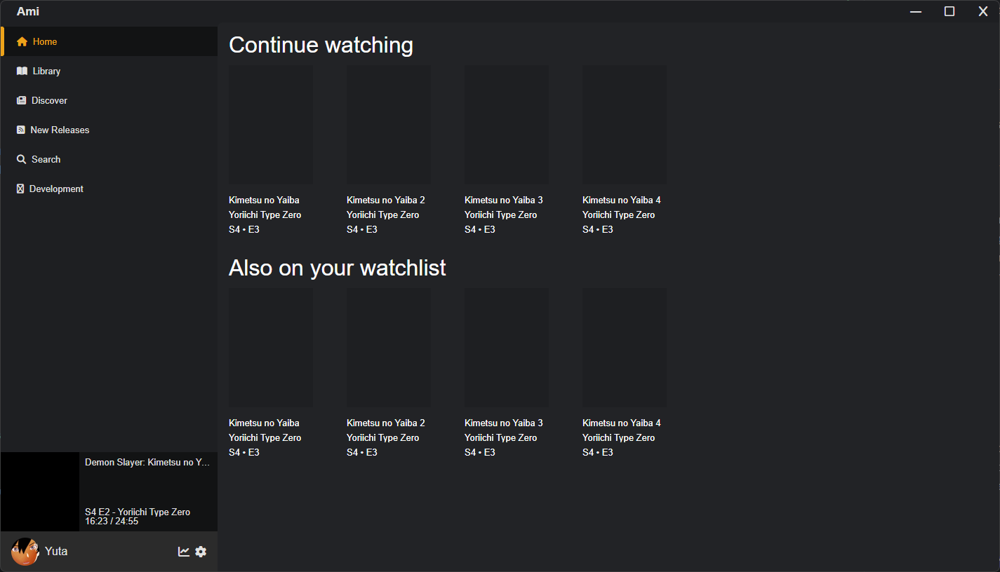
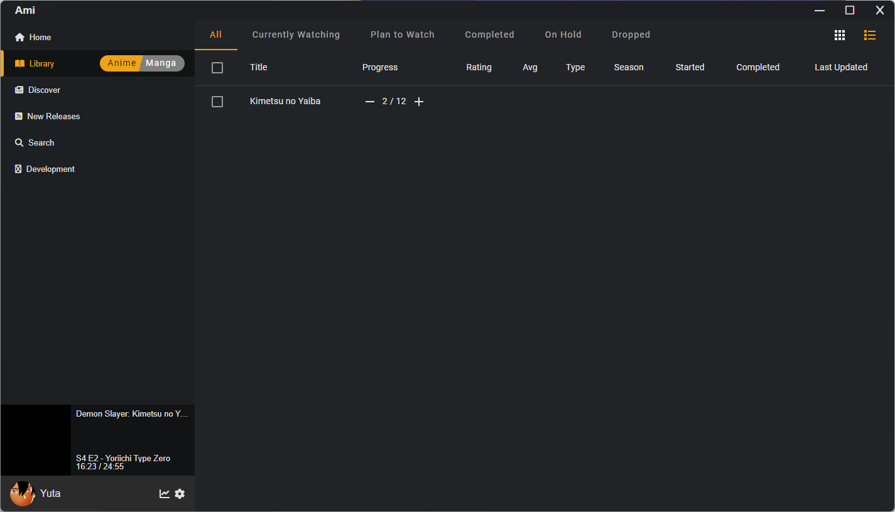

[](https://angular.io/) [](https://electronjs.org/)

[![License][license-badge]](LICENSE.md)

![Commit Activity][commit-activity]
![Last Commit][last-commit]

[![Linux Build][linux-build-badge]][linux-build]
[![MacOS Build][macos-build-badge]][macos-build]
[![Windows Build][windows-build-badge]][windows-build]

[![Watch on GitHub][github-watch-badge]][github-watch]
[![Star on GitHub][github-star-badge]][github-star]
[![Tweet][twitter-badge]][twitter]

# Introduction

Ami is a tool to track your anime and manga progress, get informed about new episodes/chapters and discover new shows.

Designed to run in your browser, on desktop and mobile.

Compatible with Mac, Linux and Windows.

## Features (planned)
- Detecting when you watch anime/read manga and automatically tracking your progress 
- Notifications when new episodes or chapters are released (optional)
- Notifications when episodes/chapters are available to stream/download (optional)
- Discover new shows, catered to your taste
- Watch anime and read manga directly from the app (no more searching for the right streaming service)
- Download anime and manga directly from the app
- And more!

## TODO
Ami is still in early development. Here are some of the things that are planned:

- Support for major anime/manga tracking services
  - Kitsu.io **(in progress)**
    - ✅ Login
    - **Fetch Library (50%)**
    - Update progress
  - AniList
    - Login
    - Fetch Library
    - Update progress
  - MyAnimeList
    - Login
    - Fetch Library
    - Update progress
- Media detection (Maybe with [Anisthesia](https://github.com/erengy/anisthesia) and [Anitomy](https://github.com/erengy/anitomy)?)
  - In desktop applications (VLC, MPV, etc.)
  - In streaming websites (Netflix, Crunchyroll, etc.)
  - In media servers (Plex, Jellyfin, etc.)
    - Local Plex ([Reddit: Is there a Plex API I can use to detect if media is playing?](https://www.reddit.com/r/PleX/comments/3dislo/is_there_a_plex_api_i_can_use_to_detect_if_media/))
- Automatic tracking
- Notifications
- Downloads
- Streaming
- Airing times
- Discover
  - Popular
  - Trending
  - Seasons
  - Recommendations based on your library (Maybe with [Sprout Anime Recommender](https://anime.ameo.dev/interactive-recommender))
- Synchronize all connected tracking services with local library
- Discord Rich Presence
- Search (on tracking service and local library)
- Personal Statistics
- Multiple Themes + Customization
- Multiple Languages
- Unit Tests


## Screenshots
### Home


### Library


# Development

## Getting Started

*Clone this repository locally:*

``` bash
git clone https://github.com/yutamago/ami.git
```

*Install dependencies with npm (used by Electron renderer process):*

``` bash
npm install
```

There is an issue with `yarn` and `node_modules` when the application is built by the packager. Please use `npm` as dependencies manager.

If you want to generate Angular components with Angular-cli , you **MUST** install `@angular/cli` in npm global context.
Please follow [Angular-cli documentation](https://github.com/angular/angular-cli) if you had installed a previous version of `angular-cli`.

``` bash
npm install -g @angular/cli
```

*Install NodeJS dependencies with npm (used by Electron main process):*

``` bash
cd app/
npm install
```

Why two package.json ? This project follow [Electron Builder two package.json structure](https://www.electron.build/tutorials/two-package-structure) in order to optimize final bundle and be still able to use Angular `ng add` feature.

## To build for development

- **in a terminal window** -> npm start

Voila! You can use your Angular + Electron app in a local development environment with hot reload!

The application code is managed by `app/main.ts`. In this sample, the app runs with a simple Angular App (http://localhost:4200), and an Electron window. \
The Angular component contains an example of Electron and NodeJS native lib import. \
You can disable "Developer Tools" by commenting `win.webContents.openDevTools();` in `app/main.ts`.

## Project structure

| Folder | Description                                      |
|--------|--------------------------------------------------|
| app    | Electron main process folder (NodeJS)            |
| src    | Electron renderer process folder (Web / Angular) |

## How to import 3rd party libraries

This sample project runs in both modes (web and electron). To make this work, **you have to import your dependencies the right way**. \

There are two kind of 3rd party libraries :
- NodeJS's one - Uses NodeJS core module (crypto, fs, util...)
    - I suggest you add this kind of 3rd party library in `dependencies` of both `app/package.json` and `package.json (root folder)` in order to make it work in both Electron's Main process (app folder) and Electron's Renderer process (src folder).

Please check `providers/electron.service.ts` to watch how conditional import of libraries has to be done when using NodeJS / 3rd party libraries in renderer context (i.e. Angular).

- Web's one (like bootstrap, material, tailwind...)
    - It have to be added in `dependencies` of `package.json  (root folder)`

## Add a dependency with ng-add

You may encounter some difficulties with `ng-add` because this project doesn't use the defaults `@angular-builders`. \
For example you can find [here](HOW_TO.md) how to install Angular-Material with `ng-add`.

## Browser mode

Maybe you only want to execute the application in the browser with hot reload? Just run `npm run ng:serve:web`.

## Included Commands

| Command                  | Description                                                                                           |
|--------------------------|-------------------------------------------------------------------------------------------------------|
| `npm run ng:serve`       | Execute the app in the web browser (DEV mode)                                                         |
| `npm run web:build`      | Build the app that can be used directly in the web browser. Your built files are in the /dist folder. |
| `npm run electron:local` | Builds your application and start electron locally                                                    |
| `npm run electron:build` | Builds your application and creates an app consumable based on your operating system                  |

**Your application is optimised. Only /dist folder and NodeJS dependencies are included in the final bundle.**

## You want to use a specific lib (like rxjs) in electron main thread ?

YES! You can do it! Just by importing your library in npm dependencies section of `app/package.json` with `npm install --save XXXXX`. \
It will be loaded by electron during build phase and added to your final bundle. \
Then use your library by importing it in `app/main.ts` file. Quite simple, isn't it?

## E2E Testing

E2E Test scripts can be found in `e2e` folder.

| Command       | Description               |
|---------------|---------------------------|
| `npm run e2e` | Execute end to end tests  |

Note: To make it work behind a proxy, you can add this proxy exception in your terminal  
`export {no_proxy,NO_PROXY}="127.0.0.1,localhost"`

## Debug with VsCode

[VsCode](https://code.visualstudio.com/) debug configuration is available! In order to use it, you need the extension [Debugger for Chrome](https://marketplace.visualstudio.com/items?itemName=msjsdiag.debugger-for-chrome).

Then set some breakpoints in your application's source code.

Finally from VsCode press **Ctrl+Shift+D** and select **Application Debug** and press **F5**.

Please note that Hot reload is only available in Renderer process.

## Want to use Angular Material ? Ngx-Bootstrap ?

Please refer to [HOW_TO file](./HOW_TO.md)

## Credits
Made with https://github.com/maximegris/angular-electron


[last-commit]: https://img.shields.io/github/last-commit/yutamago/ami
[commit-activity]: https://img.shields.io/github/commit-activity/m/yutamago/ami
[license-badge]: https://img.shields.io/badge/license-MIT-blue.svg
[license]: https://github.com/yutamago/ami/blob/main/LICENSE.md
[prs-badge]: https://img.shields.io/badge/PRs-welcome-red.svg
[prs]: http://makeapullrequest.com

[linux-build-badge]: https://github.com/yutamago/ami/workflows/Linux%20Build/badge.svg
[linux-build]: https://github.com/yutamago/ami/actions?query=workflow%3A%22Linux+Build%22
[macos-build-badge]: https://github.com/yutamago/ami/workflows/MacOS%20Build/badge.svg
[macos-build]: https://github.com/yutamago/ami/actions?query=workflow%3A%22MacOS+Build%22
[windows-build-badge]: https://github.com/yutamago/ami/workflows/Windows%20Build/badge.svg
[windows-build]: https://github.com/yutamago/ami/actions?query=workflow%3A%22Windows+Build%22

[github-watch-badge]: https://img.shields.io/github/watchers/yutamago/ami.svg?style=social
[github-watch]: https://github.com/yutamago/ami/watchers
[github-star-badge]: https://img.shields.io/github/stars/yutamago/ami.svg?style=social
[github-star]: https://github.com/yutamago/ami/stargazers
[twitter]: https://twitter.com/intent/tweet?text=Check%20out%20angular-electron!%20https://github.com/yutamago/ami%20%F0%9F%91%8D
[twitter-badge]: https://img.shields.io/twitter/url/https/github.com/yutamago/ami.svg?style=social
